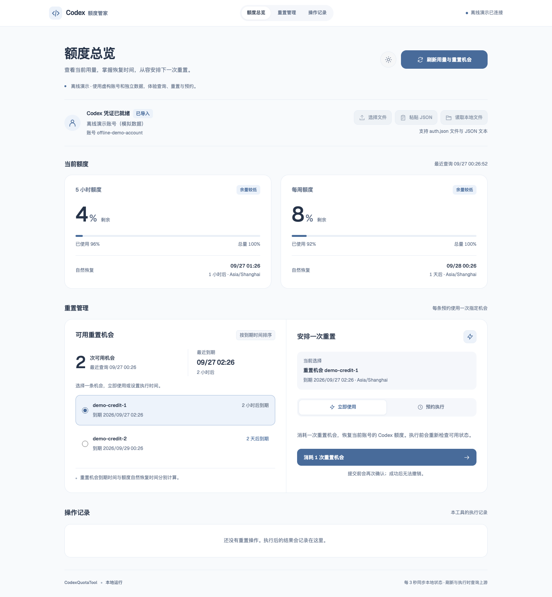

# CodexQuotaTool

[中文](README_CN.md) · English

A local dashboard for Codex account usage and reset credits. Import your OAuth
`auth.json` to view quota windows, check credit expiry dates, redeem a credit, or
schedule a one-time redemption.

- View remaining quota and each window's reset time.
- Use a specific reset credit immediately or at a scheduled time.
- Manage independent schedules and inspect their operation records.
- Try the workflow with an isolated, offline demo account.



[Dark mode preview](docs/dashboard-dark.png)

The interface uses generous whitespace, light section dividers, a muted blue
accent, and locally served Geist typography. Light mode is the default; the
appearance button beside the page title cycles through light, dark, and system
modes and remembers the choice locally. The refresh button morphs in place
between querying, completion, and failure states. Spring-driven tabs and quota
meters respect the system's reduced-motion preference.

## Quick start

Requirements: **macOS or Linux, Python 3.10+, and curl**. The service uses the Python
standard library; the dashboard is static HTML, CSS, and JavaScript.

```sh
git clone https://github.com/T-Atlas/CodexQuotaTool.git
cd CodexQuotaTool
./run.sh start
```

The launcher opens the dashboard and prints its URL. It searches for an available
loopback port starting at `8765`. On macOS, you can also double-click
`启动.command`.

Upload `auth.json`, or click **粘贴 JSON**, paste its contents, and select
**解析并导入**. Then click **刷新用量与重置机会** to query your account. You can also
place the file in the project directory; the service reads changes while idle.
The dashboard currently uses Chinese labels.

Supported credentials include Codex's nested `tokens` object and CLIProxyAPI's
flat OAuth format. Both need an `access_token` and an account ID, supplied as
`account_id` or present in the token's account claims. An available `refresh_token`
allows the service to renew expired access tokens and save the updated credentials
locally. These endpoints use ChatGPT account credentials; OpenAI API keys are for
a separate API.

## Reset credits and schedules

Quota windows recover at their reported reset time. A reset credit has its own
expiry time and can restore eligible windows before then.

Select a credit to redeem it immediately or choose a future time. Each schedule
uses one specific credit ID. Different credits can have separate schedules, and
each schedule can be cancelled before it runs. The confirmation dialog shows the
account, credit, time, and browser time zone.

The service checks the selected credit before redemption. It saves the request
UUID before contacting the upstream service, then queries usage and credit details
to verify the result. An uncertain result pauses further redemptions for that
account. Use **核实结果** to query the outcome; an explicit retry uses the same
request UUID and credit ID.

Schedules and operation records persist across service restarts. Keep the computer
awake, connected, and the service running for scheduled execution. Closing the
browser or terminal leaves the background service running. Start the service again
after rebooting. An expired credit or a schedule more than 15 minutes late is skipped.

## Commands

```sh
./run.sh start --no-open  # Start in the background
./run.sh status          # Show the service URL and status
./run.sh open            # Open the dashboard
./run.sh restart         # Restart on the current port
./run.sh stop            # Finish active work and stop
./run.sh run             # Run in the foreground
./run.sh logs            # Show recent service logs
./run.sh test            # Run Python tests
```

Add `--demo` to operate the offline demo:

```sh
./run.sh start --demo
./run.sh stop --demo
```

The demo uses a simulated account and its own data directory, with the same
dashboard, scheduler, and operation tracking. Consumed demo credits remain
consumed across restarts. Demo ports start at `8785`.

Set `CODEX_QUOTA_PORT` for the account service or `CODEX_QUOTA_DEMO_PORT` for the
demo service when you need a specific port:

```sh
CODEX_QUOTA_PORT=8888 ./run.sh start
```

The curl transport follows the standard `HTTPS_PROXY` environment variable. Set
it when starting or restarting the service if your network needs a proxy.

## Local data

| Path | Contents |
| --- | --- |
| `auth.json` | OAuth credentials, restricted to the current user |
| `state.json` | Usage cache, schedules, and operation records |
| `.runtime.json`, `.server.lock` | Service identity and instance lock |
| `server.log` | Service diagnostics |
| `data/demo/` | Isolated demo credentials and state |

The server binds to `127.0.0.1`, validates request origins, and requires a local
session token for mutations. The dashboard shows an account summary after import
and clears pasted text when the input dialog closes. Credential tokens stay out
of process arguments. Requests go to fixed ChatGPT quota endpoints and the OpenAI
OAuth token endpoint. These local data files are covered by `.gitignore`.

Treat credentials and state files as private. Bug reports should include the
platform, error status, and reproduction steps using demo data. Keep account
credentials and identifiers out of attachments.

## Troubleshooting

- **401 after renewal:** sign in to Codex again and import the updated `auth.json`.
- **403 or connection failure:** check account access and the service's proxy settings.
- **Account change blocked:** cancel pending schedules and resolve uncertain operations before switching accounts. Updating credentials for the same account is supported.
- **Redemption succeeded, verification pending:** refresh or use the read-only verification action. The successful operation remains recorded.
- **State cannot be read:** stop the service and inspect the file. Valid operation records are required before redemptions can resume.

The ChatGPT account endpoints can change independently of this project. Request
and response handling follows the [Codex backend client](https://github.com/openai/codex/blob/5c5308fc9a9ee789049d646ef11e5400384b9c6f/codex-rs/backend-client/src/client/rate_limit_resets.rs)
and the [CLIProxyAPI management dashboard](https://github.com/router-for-me/Cli-Proxy-API-Management-Center/blob/bbac79d2222a0f345458203a5ab92d859f30ff30/src/features/quota/providers/codex/data.ts).

## Development

`core.py` handles credentials, quota queries, operation records, and scheduling.
`server.py` exposes the local HTTP interface. `manage.py` controls the service
process, `demo.py` supplies the simulated upstream, and `web/` contains the UI.

Install the Python development tools and run the checks:

```sh
python3 -m venv .venv
. .venv/bin/activate
python -m pip install -r requirements-dev.txt
ruff check .
ruff format --check .
python -m unittest discover -s tests -v
sh -n run.sh
sh -n 启动.command
```

For frontend formatting and browser tests, use Node.js 24+:

```sh
npm ci
npx playwright install chromium
npm run format:check
npm run test:ui
```

`PLAYWRIGHT_CHANNEL=chrome npm run test:ui` uses an installed Google Chrome.
Browser tests launch a temporary demo instance and remove its data afterward.
Python tests use mock upstream responses and controllable clocks. The checks cover
scheduling, redemption recovery, credential updates, local HTTP access, and
dashboard interactions.

Animations are rendered by `QuotaMotion.seek(t)` in `web/motion.js`, with `t` in
seconds on the `performance.now() / 1000` clock. Input records timestamped target
changes; closed-form spring responses are summed to compute each frame. Browser
checks cover out-of-order seeking, rapid reversals, mutually exclusive text
states, failure feedback, reduced motion, saved themes, cross-tab synchronization,
and text contrast. Business state polling runs independently of the animation
clock. Set `UI_SCREENSHOT_DIR=/tmp/quota-ui` when running browser tests to export
light, dark, and mobile screenshots.

Contributions should contain a focused change, regression tests for behavior
changes, and matching updates to both READMEs. Run `ruff format .` and
`npm run format` when editing Python or frontend files.

## License

[MIT](LICENSE), copyright 2026 Lian Junhong.

The bundled [Geist font](https://github.com/vercel/geist-font) is distributed under
the [SIL Open Font License 1.1](web/fonts/OFL.txt).
